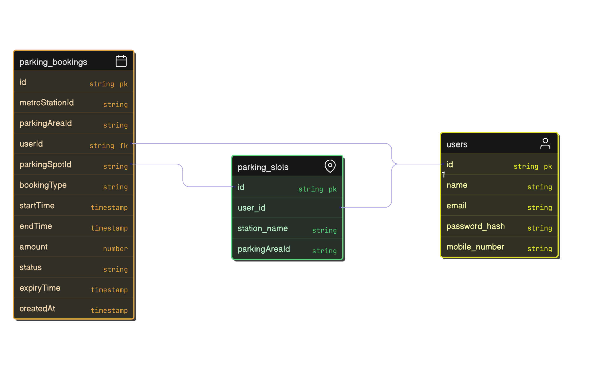

# Park and Ride Backend





## Overview
This is the backend for the Park and Ride system, which allows users to book parking spaces, manage reservations, and authenticate securely.

## Tech Stack
- Node.js
- Express.js
- MongoDB (with Mongoose ODM)
- Security Libraries: Helmet, CORS, XSS-Clean, Express Rate Limit

## Setup Instructions
1. Clone the repository:
   
   ```sh
   git clone https://github.com/ronit044/ronit044-park_and_ride_backend.git
   cd ronit044-park_and_ride_backend
   ```

2. Install dependencies:
   
   ```sh
   npm install
   ```

3. Create a `.env` file and add the following environment variables:
   
   ```env
   PORT=5000
   MONGO_URI=<your_mongodb_connection_string>
   ```

4. Start the server:
   
   ```sh
   npm start
   ```

---

## API Routes

### Authentication Routes
| Method | Endpoint       | Description          | Body Params |
|--------|---------------|----------------------|-------------|
| POST   | /api/auth/signup | Register a new user | `{ fullName, email, password, Mobile }` |
| POST   | /api/auth/login  | Login an existing user | `{ email, password }` |

### Parking Routes
| Method | Endpoint               | Description                   | Auth Required | Body Params / Query |
|--------|------------------------|-------------------------------|--------------|----------------------|
| GET    | /api/parking           | Get all parking data          | ❌ | None |
| POST   | /api/parking/book      | Book a parking spot           | ✅ | `{ parkingId, timeSlot }` |
| GET    | /api/user-bookings     | Get user’s parking bookings   | ✅ | None |

### Responses
- Success: `{ success: true, data: {...} }`
- Error: `{ success: false, message: "Error message" }`

## License
This project is licensed under the MIT License.
